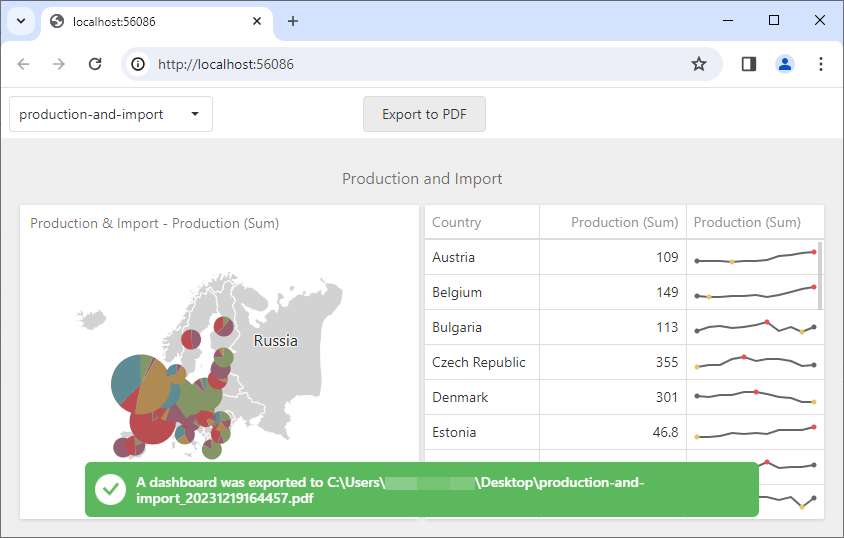

<!-- default badges list -->

<!-- default badges end -->

# BI Dashboard for Web Forms - How to implement server-side export

This example shows how to export a dashboard displayed in [ASPxDashboard](https://docs.devexpress.com/Dashboard/DevExpress.DashboardWeb.ASPxDashboard) on the server. When you click **Export to PDF**, the [ASPxDashboardExporter](https://docs.devexpress.com/Dashboard/DevExpress.DashboardWeb.ASPxDashboardExporter) exports the displayed dashboard with the specified dashboard state to your desktop.

The following API is used to implement this functionality:

- The [ASPxDashboard.CustomJSProperties](https://docs.devexpress.com/Dashboard/DevExpress.DashboardWeb.ASPxDashboard.CustomJSProperties) server-side event is used to pass information about available dashboards to the client side.
- The [DashboardControl.loadDashboard](https://docs.devexpress.com/Dashboard/js-DevExpress.Dashboard.DashboardControl?p=netframework#js_devexpress_dashboard_dashboardcontrol_loaddashboard_dashboardid_) method opens a selected dashboard.  
- The [ASPxClientDashboard.PerformDataCallback](https://docs.devexpress.com/Dashboard/js-DevExpress.Dashboard.Web.WebForms.ASPxClientDashboard?p=netframework#js_aspxclientdashboard_performdatacallback_parameter_oncallback_) method is used to pass the dashboard identifier and state to the server. On the server, the [ASPxDashboard.CustomDataCallback](https://docs.devexpress.com/Dashboard/DevExpress.DashboardWeb.ASPxDashboard.CustomDataCallback?p=netframework) event is used to obtain and parse these values.  
- [ASPxDashboardExporter.ExportToPdf](https://docs.devexpress.com/Dashboard/DevExpress.DashboardWeb.WebDashboardExporter.ExportToPdf.overloads) is used to export the selected dashboard with the state passed from the client.

## Files to Review

* [Default.aspx](./CS/ASPxDashboard_ServerExport/Default.aspx) (VB: [Default.aspx](./VB/ASPxDashboard_ServerExport/Default.aspx))
* [Default.aspx.cs](./CS/ASPxDashboard_ServerExport/Default.aspx.cs) (VB: [Default.aspx.vb](./VB/ASPxDashboard_ServerExport/Default.aspx.vb))
* [InitializeControls.js](./CS/ASPxDashboard_ServerExport/Scripts/InitializeControls.js) (VB: [InitializeControls.js](./VB/ASPxDashboard_ServerExport/Scripts/InitializeControls.js))

## Documentation

- [Manage Exporting Capabilities in ASP.NET Web Forms](https://docs.devexpress.com/Dashboard/12140/web-dashboard/integrate-dashboard-component/aspnet-web-forms-dashboard-control/manage-exporting-capabilities)
- [ASPxDashboardExporter](https://docs.devexpress.com/Dashboard/DevExpress.DashboardWeb.ASPxDashboardExporter)

## More Example

- [BI Dashboard for MVC - How to implement server-side export](https://github.com/DevExpress-Examples/asp-net-mvc-dashboard-implement-server-side-export)
- [BI Dashboard for Web Forms - How to export Web Dashboard into PDF with different filter values on different pages](https://github.com/DevExpress-Examples/web-forms-dashboard-pdf-export-with-filter-values-on-different-pages)
- [BI Dashboard for Web Forms - How to add custom information to the exported dashboard](https://github.com/DevExpress-Examples/web-forms-dashboard-add-custom-information-to-exported-dashboard)
